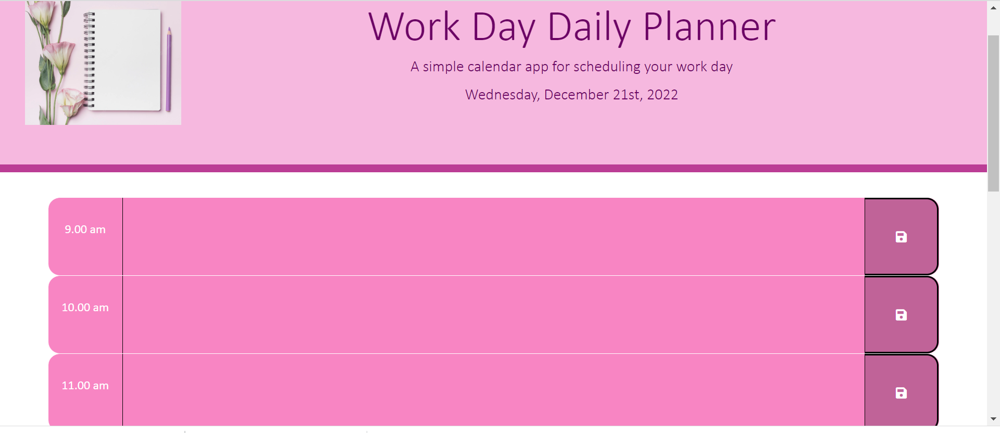

# Daily-Work-Day-Planner

As an employee with a busy schedule I want to add important events to a daily planner so that I can manage my time effectively. This project involved us to create a simple calendar application that allows a user to save events for each hour of the day by modifying starter code. This app will run in the browser and feature dynamically updated HTML and CSS powered by jQuery.

# Description

These are the criteria given to us :

* Display the current day at the top of the calender when a user opens the   planner.
 
* Present timeblocks for standard business hours when the user scrolls down.
 
* Color-code each timeblock based on past, present, and future when the timeblock is viewed.
 
* Allow a user to enter an event when they click a timeblock

* Save the event in local storage when the save button is clicked in that timeblock.

* Persist events between refreshes of a page

The following animation demonstrates the application functionality:

# Getting Started

Step 1

I created a new repository on my GitHub account and clone it to my computer using git clone command.

Then I deployed it by using the git add, git commit, and git push commands to save and push my code to my GitHub repository.

I Navigated to my GitHub repository in the browser and then select the Settings tab on the right side of the page.

On the Settings page, scrolled down to the GitHub Pages section. Then, in the section labeled Source, select the main branch as my source.

This led to my webpage viral https://najma53.github.io/Daily-Work-Day-Planner

Step 2

I started with index.html file first, made divs to hold time block, textarea and button for each hour of the working day. (9.00 am to 5.00pm). The classes in the divs are matched with style.css hence I dont have to changed the CSS file later on if I had given my own names to the classes. Once that was done I started playing with style.css and see what I can change. Found out I could change few things but the major was was undoable at this time (time block and textarea/description were still showing white spaces). 

Step 3

Created script.js file and linked it to index.html file. Then started writing the code in jquery using moments to display day and date on screen. More codes were written to try meet acceptance criteria.

Step 4

I went back to style.css file and index.html five to give a few final touches to it. I added a footer and a image and then formated it using stle.css. After everything was completed this is how my application looks like 

# Conclusion
It was nice straight forward project. Took me a while to write jsquery but it tied all the components we have learned so far especially getting items from local storage. It allowed us to go back to css and play around with it and also the bootstrap which we had touched few weeks ago came back. Enjoyed it very much. Not sure what I have done is correct but loved it.
